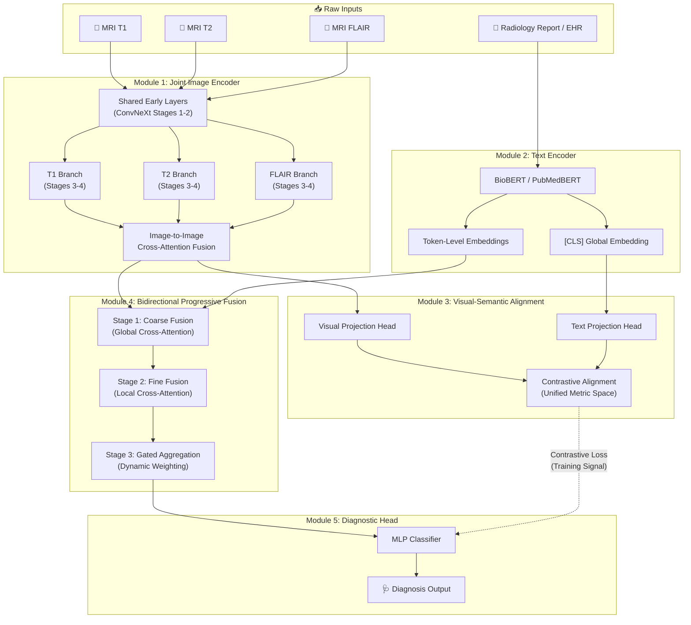
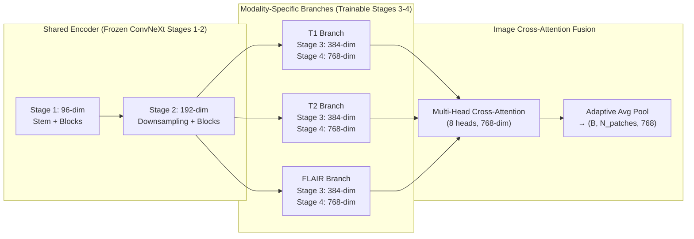
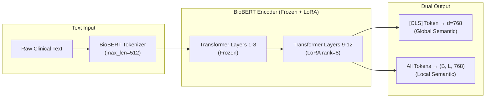
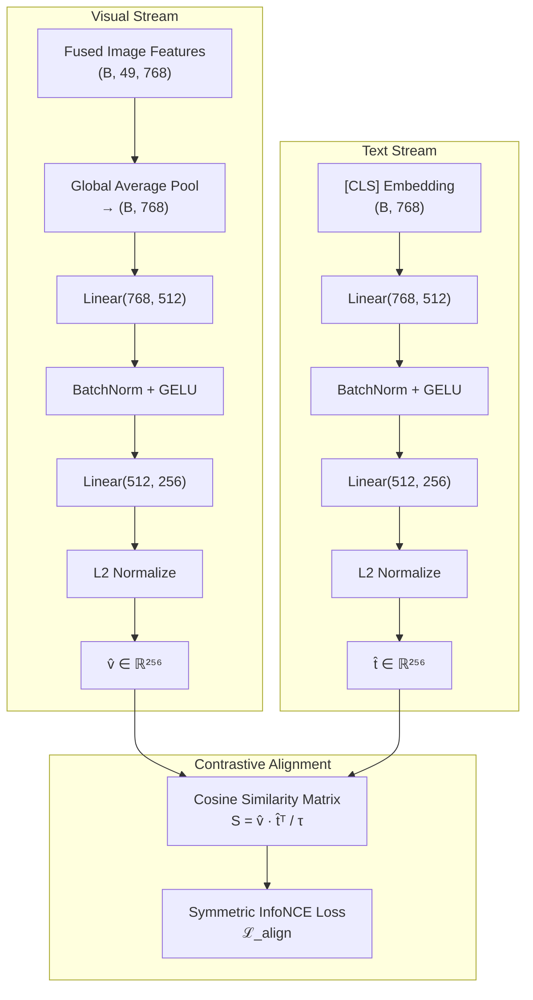
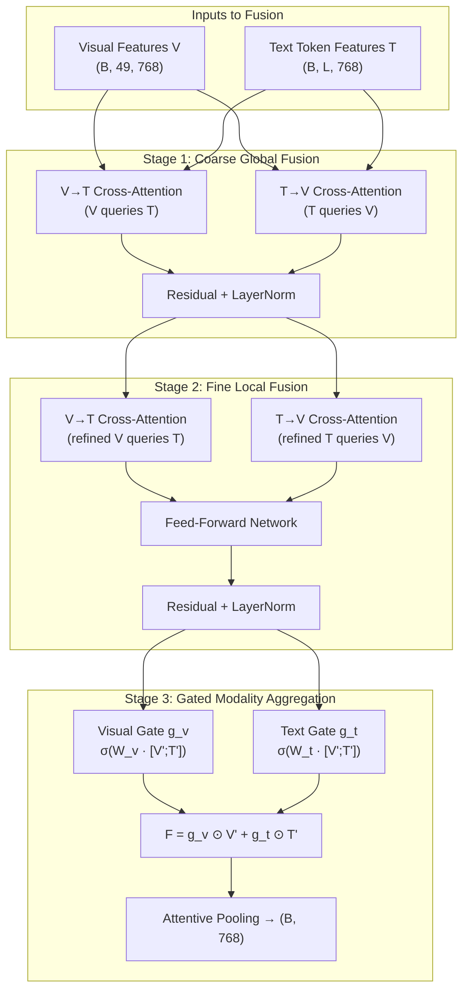
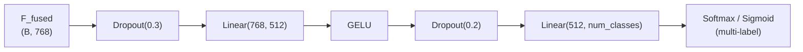

# Omni-Modal Diagnostic Framework — Architecture Design

> **Goal**: Design a unified framework that fuses multi-modal medical images (MRI T1, T2, FLAIR, CT) **and** clinical text (EHR / radiology reports) into a single diagnostic pipeline using bidirectional progressive fusion with dynamic attention-based modality weighting.

---

## 1. System Architecture Overview

The framework is organized into **five core modules** that form a complete pipeline from raw inputs to diagnostic output:



---

## 2. Module 1 — Joint Image Encoder (Multi-Modal MRI)

### Purpose
Encode multiple imaging modalities (T1, T2, FLAIR) into a unified visual representation while preserving modality-specific features.

### Architecture: Shared-then-Split ConvNeXt



### Design Rationale

| Decision | Rationale |
|----------|-----------|
| **Shared early layers** | Low-level features (edges, textures) are similar across MRI modalities; sharing reduces parameters by ~40% |
| **Split late layers** | High-level features diverge across modalities (T1 shows anatomy, T2 shows pathology, FLAIR shows edema) |
| **ConvNeXt backbone** | Outperforms ResNet50 by ~3% on medical imaging benchmarks while maintaining CNN inductive biases (locality, translation equivariance) |
| **Cross-attention fusion** | Dynamically learns which modality patches are most relevant, unlike static concatenation |

### Key Dimensions

| Stage | Output Shape | Notes |
|-------|-------------|-------|
| Input (per modality) | `(B, 1, 224, 224)` | Grayscale MRI slices |
| After Stage 2 (shared) | `(B, 192, 28, 28)` | Shared low-level features |
| After Stage 4 (per branch) | `(B, 768, 7, 7)` | Modality-specific high-level features |
| After Flatten + Pool | `(B, 49, 768)` | 49 spatial patches, 768-dim each |
| After Cross-Attention Fusion | `(B, 49, 768)` | Fused multi-modal visual features |

---

## 3. Module 2 — Text Encoder (Clinical NLP)

### Purpose
Encode clinical text (radiology reports, EHR notes) into both **global** (sentence-level) and **local** (token-level) semantic embeddings.

### Architecture



### Model Selection Comparison

| Model | Domain | Vocab | Recommended Use |
|-------|--------|-------|-----------------|
| **PubMedBERT** | Biomedical literature | Custom PubMed vocab | ✅ **Primary choice** — trained from scratch on PubMed, no domain mismatch |
| BioBERT v1.1 | General + Biomedical | BERT vocab + fine-tuned | Good alternative, well-established |
| ClinicalBERT | Clinical notes (MIMIC) | BERT vocab + fine-tuned | Best for ICU/clinical text specifically |
| BioGPT | Biomedical generative | GPT vocab | Overkill for encoding; better for generation tasks |

> [!TIP]
> **Why LoRA instead of full fine-tuning?** With limited medical data, full fine-tuning of BioBERT risks catastrophic forgetting. LoRA (Low-Rank Adaptation, rank=8) adds only ~0.3% trainable parameters while preserving pre-trained biomedical knowledge.

---

## 4. Module 3 — Visual-Semantic Alignment Module ⭐

This is the **core innovation** of the framework. It maps the visual feature space and the text embedding space into a **shared metric space** where semantically similar image-text pairs are close and dissimilar pairs are far apart.

### Architecture



### Mathematical Formulation

**Projection Heads:**
```
v̂ = L2Norm( W₂ᵛ · GELU(BN(W₁ᵛ · GAP(F_img))) )     ∈ ℝ²⁵⁶
t̂ = L2Norm( W₂ᵗ · GELU(BN(W₁ᵗ · h_[CLS]))   )       ∈ ℝ²⁵⁶
```

**Cosine Similarity Matrix:**
```
S_ij = (v̂_i · t̂_j) / τ
```
where `τ` is a **learnable temperature** parameter (initialized to 0.07, following CLIP).

**Symmetric InfoNCE Loss (CLIP-style):**
```
ℒ_v→t = -1/B · Σᵢ log( exp(S_ii) / Σⱼ exp(S_ij) )    (image-to-text)
ℒ_t→v = -1/B · Σᵢ log( exp(S_ii) / Σⱼ exp(S_ji) )    (text-to-image)
ℒ_align = (ℒ_v→t + ℒ_t→v) / 2
```

> [!IMPORTANT]
> **Why 256-dim projection?** Research shows that the contrastive alignment space should be lower-dimensional than the encoder outputs to act as an "information bottleneck," forcing the model to retain only diagnostically relevant cross-modal features. 256-dim is the sweet spot found in MedCLIP and BiomedCLIP.

### What This Module Achieves

1. **Bridges the modality gap** — Raw CNN features and BioBERT embeddings live in incompatible spaces. The projection heads create a shared metric space.
2. **Enables zero-shot transfer** — Once aligned, the model can perform zero-shot classification by comparing image embeddings against text label embeddings.
3. **Provides training signal for fusion** — The contrastive loss acts as an auxiliary objective that regularizes the bidirectional fusion module (Module 4).

---

## 5. Module 4 — Bidirectional Progressive Fusion Engine ⭐

This module performs the **reciprocal, multi-stage fusion** of visual and textual features, allowing each modality to progressively refine the other through cross-attention.

### Architecture Overview



### Stage-by-Stage Breakdown

#### Stage 1 — Coarse Global Fusion
The first stage performs **bidirectional cross-attention** to establish global correspondences:

```
# Image attends to text (V→T):
V' = LayerNorm(V + MultiHeadAttn(Q=V, K=T, V=T))

# Text attends to image (T→V):
T' = LayerNorm(T + MultiHeadAttn(Q=T, K=V, V=V))
```

**Purpose**: Lets visual patches "ask" the text which regions are diagnostically important (e.g., "the report mentions an opacity in the right lung" → patches in that region get amplified). Simultaneously, text tokens "look at" the image to ground abstract terms in spatial locations.

#### Stage 2 — Fine Local Fusion
Repeats the bidirectional cross-attention on the **already-refined** features, with an additional FFN:

```
V'' = LayerNorm(V' + MultiHeadAttn(Q=V', K=T', V=T'))
T'' = LayerNorm(T' + MultiHeadAttn(Q=T', K=V', V=V'))

V'' = LayerNorm(V'' + FFN(V''))
T'' = LayerNorm(T'' + FFN(T''))
```

**Purpose**: Captures fine-grained, local-level alignments (e.g., matching the phrase "3mm nodule" to a specific 2×2 patch region in the CT scan).

#### Stage 3 — Gated Modality Aggregation
Dynamically weights the contribution of each modality using **learned sigmoid gates**:

```
# Compute gates from concatenated features
g_v = σ(W_v · [V''; T''] + b_v)     ∈ [0, 1]
g_t = σ(W_t · [V''; T''] + b_t)     ∈ [0, 1]

# Weighted aggregation
F_fused = g_v ⊙ Pool(V'') + g_t ⊙ Pool(T'')
```

**Purpose**: The gates learn instance-specific weighting. For a case with a highly descriptive radiology report but a noisy image, `g_t > g_v`. For a case with a clear image but sparse text, `g_v > g_t`. This is critical for clinical robustness.

> [!IMPORTANT]
> **Why "progressive" (2 stages of cross-attention)?** A single cross-attention layer cannot capture both global correspondences (disease category ↔ overall scan appearance) and local alignments (specific finding ↔ specific patch). Progressive refinement, validated by BiPVL-Seg (2025), achieves both.

### Attention Weight Visualization (Explainability)

The cross-attention weights from Stage 2 are **directly interpretable**:
- **V→T attention map**: Shows which text tokens each image patch is attending to → "This patch in the lung is most influenced by the word 'consolidation'"
- **T→V attention map**: Shows which image patches each text token is grounding to → "The word 'effusion' is looking at the lower-left lung region"

This addresses the **"Black-Box" Explainability Problem** from your bottleneck analysis.

---

## 6. Module 5 — Diagnostic Classification Head



---

## 7. Training Strategy

### Phase 1 — Contrastive Pre-training (Alignment)
- **Objective**: Train only Module 3 (Visual-Semantic Alignment) + projection heads
- **Loss**: `ℒ_align` (Symmetric InfoNCE)
- **Freeze**: Image encoder (ConvNeXt) + Text encoder (BioBERT) fully frozen
- **Epochs**: 50 | **LR**: 1e-4 | **Batch size**: 256 (large for contrastive learning)
- **Purpose**: Establish the shared metric space before fusion

### Phase 2 — Fusion Training
- **Objective**: Train Module 4 (Bidirectional Progressive Fusion) + Module 5 (Classifier)
- **Loss**: `ℒ_cls` (Cross-Entropy or Focal Loss for imbalanced data) + `0.1 × ℒ_align`
- **Unfreeze**: LoRA adapters on BioBERT layers 9-12, ConvNeXt Stages 3-4
- **Epochs**: 100 | **LR**: 5e-5 | **Scheduler**: Cosine Annealing with Warmup (10 epochs)

### Phase 3 — End-to-End Fine-tuning
- **Objective**: Fine-tune entire pipeline end-to-end
- **Loss**: `ℒ_total = ℒ_cls + λ₁ℒ_align + λ₂ℒ_reg`
- **LR**: 1e-6 (very low to preserve learned representations)
- **Epochs**: 20

### Loss Function Summary

```
ℒ_total = ℒ_cls + λ₁ · ℒ_align + λ₂ · ℒ_modality_dropout

where:
  ℒ_cls     = Focal Loss (γ=2, α per class)     — handles class imbalance
  ℒ_align   = Symmetric InfoNCE                  — visual-semantic alignment
  ℒ_reg     = L2 weight decay (1e-4)             — regularization
  λ₁ = 0.1, λ₂ = 0.01
```

> [!TIP]
> **Modality Dropout**: During training, randomly drop entire modalities (set to zero) with p=0.15. This forces the model to be robust when a modality is missing at inference time — critical for real clinical deployment where a patient may not have all imaging types.

---

## 8. Dataset Recommendations

| Dataset | Modalities | Size | Access |
|---------|-----------|------|--------|
| **MIMIC-CXR v2** | Chest X-ray + Radiology Reports | 377K images, 228K reports | PhysioNet (credentialed) |
| **BraTS 2024** | MRI T1, T1ce, T2, FLAIR | ~2,000 subjects | Synapse/Kaggle |
| **TCGA (GDC)** | Histopathology + Genomics + Clinical | ~11,000 cases | NIH GDC Portal |
| **CheXpert** | Chest X-ray + Labels | 224K images | Stanford ML Group |
| **PadChest** | Chest X-ray + Reports (Spanish) | 160K images | BIMCV |
| **RadNLI** | NLI pairs from radiology | 1K pairs | For text encoder eval |

> [!WARNING]
> **MIMIC-CXR** requires CITI training certification and a signed Data Use Agreement. Plan 2-4 weeks for access approval. Start the application process immediately.

---

## 9. Proposed Project Structure

```
btp/
├── configs/
│   ├── default.yaml              # Training hyperparameters
│   ├── model.yaml                # Architecture configuration
│   └── data.yaml                 # Dataset paths and preprocessing
├── src/
│   ├── models/
│   │   ├── __init__.py
│   │   ├── image_encoder.py      # Module 1: Joint Image Encoder
│   │   ├── text_encoder.py       # Module 2: BioBERT Text Encoder
│   │   ├── alignment.py          # Module 3: Visual-Semantic Alignment
│   │   ├── fusion.py             # Module 4: Bidirectional Progressive Fusion
│   │   ├── classifier.py         # Module 5: Diagnostic Head
│   │   └── omni_modal.py         # Full OmniModal Framework (ties all modules)
│   ├── data/
│   │   ├── __init__.py
│   │   ├── mimic_cxr.py          # MIMIC-CXR dataloader
│   │   ├── brats.py              # BraTS MRI dataloader
│   │   ├── transforms.py         # Medical image augmentations
│   │   └── text_utils.py         # Tokenization & text preprocessing
│   ├── training/
│   │   ├── __init__.py
│   │   ├── trainer.py            # Training loop with 3-phase curriculum
│   │   ├── losses.py             # InfoNCE, Focal Loss, combined losses
│   │   └── schedulers.py         # LR schedulers with warmup
│   ├── evaluation/
│   │   ├── __init__.py
│   │   ├── metrics.py            # AUC, F1, sensitivity, specificity
│   │   └── visualization.py      # Attention map visualization
│   └── utils/
│       ├── __init__.py
│       └── logging.py            # W&B / TensorBoard integration
├── scripts/
│   ├── train.py                  # Main training entry point
│   ├── evaluate.py               # Evaluation script
│   └── visualize_attention.py    # Generate attention heatmaps
├── requirements.txt
└── README.md
```

---

## 10. Hardware Requirements

| Component | Minimum | Recommended |
|-----------|---------|-------------|
| **GPU** | 1× RTX 3090 (24GB) | 2× A100 (80GB) |
| **RAM** | 32 GB | 64 GB |
| **Storage** | 100 GB (MIMIC-CXR) | 500 GB (all datasets) |
| **Training Time** | ~48h (Phase 1+2) | ~24h with 2× A100 |

---

## Open Questions

> [!IMPORTANT]
> **Q1: Which dataset will you use first?**
> MIMIC-CXR is the gold standard for image-text pairs but requires credentialed access. We could start prototyping with **CheXpert** (freely available) + synthetic text labels, then migrate to MIMIC-CXR once access is granted.

> [!IMPORTANT]
> **Q2: Single-task or Multi-task classification?**
> Should the diagnostic head predict a single disease (binary), multiple diseases (multi-label sigmoid), or disease + severity (hierarchical)? This affects the loss function and output layer design.

> [!IMPORTANT]
> **Q3: Scope of initial prototype?**
> Should I implement the full 5-module architecture immediately, or start with a minimal 3-module version (Image Encoder + Text Encoder + Alignment) and incrementally add the fusion engine?

> [!IMPORTANT]
> **Q4: Compute resources available?**
> The training strategy assumes GPU access. Are you using a local GPU, university cluster, or cloud (Colab Pro, AWS, GCP)? This will affect batch size, model size, and mixed-precision decisions.

---

## Verification Plan

### Automated Tests
```bash
# Unit tests for each module's forward pass
python -m pytest tests/ -v

# Smoke test: full forward pass with dummy data
python scripts/train.py --config configs/default.yaml --smoke-test

# Verify alignment: check that contrastive loss decreases
python scripts/train.py --config configs/default.yaml --phase 1 --max-epochs 5
```

### Manual Verification
- Visualize cross-attention heatmaps on sample images to verify spatial grounding
- Compare `g_v` and `g_t` gate values across different cases to confirm dynamic weighting
- Compute retrieval metrics (R@1, R@5) on the aligned embedding space
